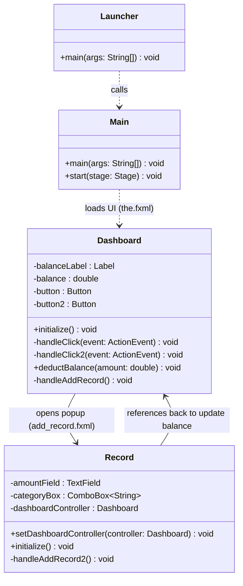

# CSE 110: Mini Wallet App

## 1. Scenario
A user opens the Mini Wallet application and is presented with their main **Dashboard**, which displays their current total balance. To log an expense, the user clicks the "Add Record" button. This action opens a popup window where they can enter the amount they spent. After entering the amount into a text field and submitting it, the system automatically subtracts this amount from the main balance. The popup window closes, and the Dashboard instantly updates to reflect the newly deducted balance, helping the user track their expenses in real-time.

## 2. UML Class Diagram
Below is the UML class diagram for the Mini Wallet application showing the relationships between the different Java classes:

## 3. Class Descriptions

### **Launcher**
A helper class containing a standard `main` method. It is used as a straightforward entry point to launch the JavaFX application, which helps bypass common module-path and classpath issues when starting JavaFX directly from the `Main` class.

### **Main**
The primary entry point of the JavaFX application that extends the `Application` class. It overrides the `start()` method to initialize the user interface by loading the `the.fxml` file, setting up the main window (Stage) and Scene, and finally displaying it to the user.

### **Dashboard**
The controller class for the main screen (`the.fxml`). It acts as the core of the user interface.
*   **Responsibilities:** It manages the state of the user's total `balance` and dynamically updates the `balanceLabel` on the screen. 
*   **Key Methods:** It contains `handleAddRecord()`, which is responsible for opening the new "Record" popup window, and `deductBalance(amount)`, which allows external classes to subtract values from the total balance and refresh the user interface.

### **Record**
The controller class for the add-record popup screen (`add_record.fxml`). 
*   **Responsibilities:** It handles user input for new expenses. It reads the numeric value entered into the text field (`amountField`).
*   **Key Methods:** It contains `handleAddRecord2()`, which validates the input and parses it into a number. Using a reference to the `Dashboard` (passed via `setDashboardController()`), it triggers the deduction on the main balance and then closes the popup window once the operation is complete.
